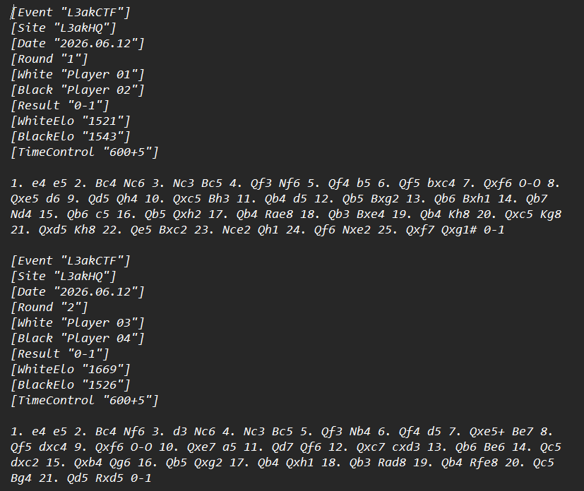
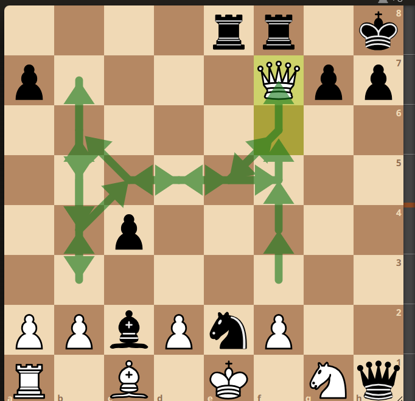
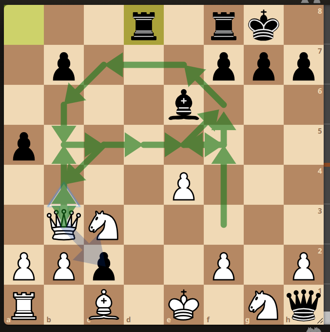

# Blunder - Writeup

# Challenge Info
- **Category:** Miscellaneous
- **Difficulty:** Easy
- **Author:** 0WL
- **Challenge Attachment:**
- **Event:** L3AK CTF 2026

`games.pgn`

We are given a file called `games.pgn`, the file content was similar to this:



which was a bunch of chess games played, and registered in this file (around 24 games).

The first thing I attempted was loading these games in Lichess (which also offers free analysis by the one and only Stockfish AI bot). You can find the game import menu through this link:

`https://lichess.org/paste`

Going through the games, I thought I'd map out all the blunders that happened throughout the games. Also, since the challenge's name was "Blunder," I first thought the blunder moves in the file were encoded using some chess steganography encoding method, so I tried a tool called chess-steg-cli in order to try to make sense of them. However, that turned out to be fruitless, as it didn't decode to anything.

# Key Observation

The next thing I did was go through every single game, paste it into Lichess, have Stockfish analyze them one by one, and watch how each piece moved and **what** pieces blundered the **most**.

Turns out, the white Queen was always left hanging, which is the reason why black won every **single** game.

So I decided to observe the white Queen more closely.

Throughout the first game, the Queen's movements in the center of the board were as follows:



Which resembles the letter H.

So I thought the flag might be hidden in the board, and the Queen's movement is the key to uncovering it.

2nd game: (Letter A)



I traced the Queen's movements by hand and assembled all the letters in this PDF file: (took a long time to make)

[Blunder-Solution.pdf](Blunder-Solution.pdf)

# Flag

```
L3AK{HARDTOKEEPUPWITHTHEQUEEN}
```

# Final Thoughts

This was a fun, low-effort-to-understand but high-effort-to-solve stego challenge!. What made it especially interesting was hiding the flag in the *shape* the Queen traced across the board over the course of a full game.